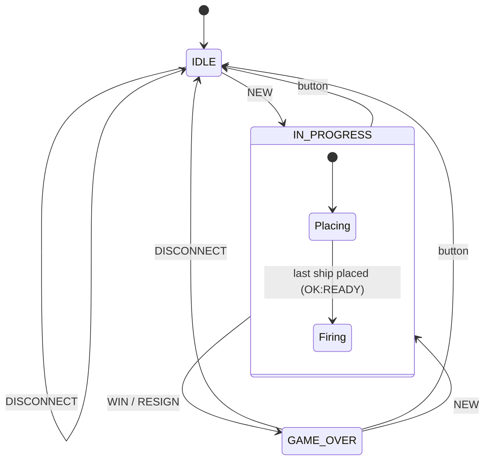
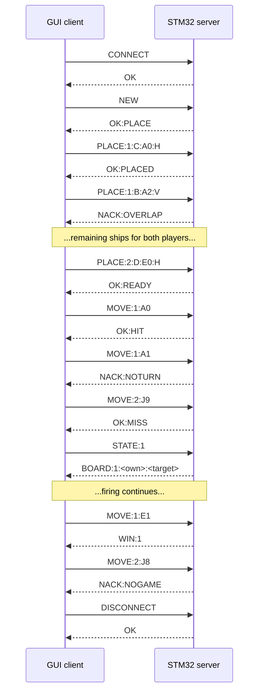

# Battleship Serial Protocol

> **Status: draft, awaiting review by both team members.**
>
> This is the contract between the PC GUI client and the STM32 server. The STM32 is the
> referee: it owns all game state and validates every request. The client only renders what
> the server confirms.

## 1. Link

| Setting      | Value                  |
|--------------|------------------------|
| Interface    | UART (USART1)          |
| Baud rate    | 115200                 |
| Frame format | 8 data bits, no parity, 1 stop bit (8N1) |
| Flow control | None                   |

## 2. Framing

### 2.1 Lines

- Every message is one line of printable ASCII (`0x20`–`0x7E`).
- **Client → server** lines end in `\n`. A `\r` immediately before the `\n` is ignored.
- **Server → client** lines end in `\r\n`.
- Fields within a line are separated by `:`.

### 2.2 Request/response

- The protocol is strictly request/response. The server sends **exactly one** reply line for
  every non-empty request, and **never sends anything unprompted**.
- Empty lines are ignored and get no reply. A client may send a bare `\n` to flush any partial
  frame left on the server, for example after reconnecting.
- The client should treat a missing reply after **1 s** as a timeout.

### 2.3 Size limits and timeouts

| Rule | Value | Behaviour |
|------|-------|-----------|
| Max request length | 64 bytes, excluding `\n` | Longer frames are discarded up to the next `\n` and answered with `NACK:TOOLONG`. |
| Partial frame timeout | 500 ms | If no byte arrives for 500 ms while a frame is incomplete, the partial frame is discarded silently. |
| Max reply length | 210 bytes, excluding `\r\n` | The longest reply is `BOARD` (§5). |

The longest valid request, `PLACE:1:C:A0:H*FF`, is 17 bytes.

### 2.4 Optional checksum

A request may end in `*HH`, where `HH` is the two-digit uppercase hex XOR of every byte before
the `*`.

| Line            | Payload      | Checksum |
|-----------------|--------------|----------|
| `CONNECT*5E`    | `CONNECT`    | `5E`     |
| `MOVE:1:B7*55`  | `MOVE:1:B7`  | `55`     |
| `OK*04`         | `OK`         | `04`     |

- If a request carries a checksum, the reply carries one too. If not, neither does the reply.
- A wrong checksum is answered with `NACK:CHECKSUM*30`, and the request is not processed.

### 2.5 Invalid bytes

A frame containing any byte outside `0x20`–`0x7E` (other than the terminating `\r\n`) is
answered with `NACK:BADCMD`.

## 3. Game rules

### 3.1 Board

- 10 × 10 grid. Rows are letters `A`–`J`, columns are digits `0`–`9`.
- A cell is written row then column: `A0` is the top-left, `J9` the bottom-right, `B7` is row
  B, column 7.
- When a board is sent as a string, cells are in row-major order: index = row × 10 + column
  (`A0` = 0, `A9` = 9, `B0` = 10, `J9` = 99).
- A cell such as `K3` or `A10` is well-formed but off the board, and is answered with
  `NACK:RANGE`. Something like `B-1` or `7B` is not a cell at all and gets `NACK:BADCMD`.

### 3.2 Fleet

Each player has one of each ship:

| Letter | Ship       | Length |
|--------|------------|--------|
| `C`    | Carrier    | 5      |
| `B`    | Battleship | 4      |
| `R`    | Cruiser    | 3      |
| `S`    | Submarine  | 3      |
| `D`    | Destroyer  | 2      |

Ships are placed by giving the bow cell and an orientation: `H` extends to the right
(increasing column), `V` extends down (increasing row). Ships may touch but not overlap, and
must lie entirely on the board.

### 3.3 Turn order

1. **Placing:** player 1 places all five ships, then player 2 places all five.
2. **Firing:** player 1 fires first. Players then alternate; every valid shot passes the turn,
   whether it hits or misses.
3. A player **wins** when every cell of the opponent's fleet has been hit.

**There is no draw.** A game of Battleship always ends with one fleet destroyed or a player
resigning, so `DRAW` is never sent (see §9).

## 4. Server states



| State         | Accepts                                               |
|---------------|-------------------------------------------------------|
| `IDLE`        | `CONNECT`, `NEW`, `DISCONNECT`                        |
| `IN_PROGRESS` | `CONNECT`, `PLACE` (placing), `MOVE` (firing), `STATE`, `RESIGN` |
| `GAME_OVER`   | `CONNECT`, `NEW`, `STATE`, `DISCONNECT`               |

- **Session:** the server tracks whether a client has sent `CONNECT`. Every other command is
  rejected with `NACK:NOSESSION` until it has. `DISCONNECT` ends the session.
- `CONNECT` is accepted in every state and **never changes the game**, so a GUI that crashed or
  was restarted can rejoin a game in progress and resync with `STATE`.
- **On-board button:** pressing it discards any game and returns to `IDLE` (the session stays
  open). The server sends no message. The client finds out on its next request
  (`NACK:NOGAME`) and should show that the game was reset.
- **On-board LED:** off in `IDLE`, solid during player 1's turn, off during player 2's turn,
  and blinking in `GAME_OVER`.

## 5. Board encoding

`STATE:<p>` returns the game as seen by player `p`:

```
BOARD:<turn>:<own>:<target>
```

| Field      | Length | Meaning |
|------------|--------|---------|
| `<turn>`   | 1      | `1` or `2`: the player expected to act next (placing or firing). `0` when the game is over. |
| `<own>`    | 100    | Player `p`'s own waters. |
| `<target>` | 100    | What player `p` knows about the opponent's waters. |

Characters:

| Char         | In `<own>`                     | In `<target>`        |
|--------------|--------------------------------|----------------------|
| `.`          | Empty water, not fired at      | Not fired at yet     |
| `C B R S D`  | Unhit ship cell of that type   | *never used*         |
| `X`          | Ship cell hit by the opponent  | Hit                  |
| `o`          | Opponent missed here           | Miss                 |

**The opponent's unhit ships are never sent.** This keeps the server authoritative over hidden
information: a modified client cannot find out where ships are.

Example: in a new game during placement, `STATE:1` returns `BOARD:1:` followed by 100 `.`,
then `:`, then another 100 `.`.

## 6. Commands

`<p>` is the player id, `1` or `2`. It must be present on every command that acts for a player
so the server can enforce turns on a shared (hotseat) client.

| Request                          | Success reply | Notes |
|----------------------------------|---------------|-------|
| `CONNECT`                        | `OK` | Opens a session. Accepted in every state. |
| `NEW`                            | `OK:PLACE` | Clears both fleets and starts placing, player 1 first. |
| `PLACE:<p>:<ship>:<cell>:<H\|V>` | `OK:PLACED` | Ship placed. When player 1 places their fifth ship, the turn passes to player 2. |
|                                  | `OK:READY` | Player 2's fifth ship was placed; firing starts with player 1. |
| `MOVE:<p>:<cell>`                | `OK:MISS` | No ship at the target cell. |
|                                  | `OK:HIT` | Hit a ship that is still afloat. |
|                                  | `OK:SUNK:<ship>` | The hit sank that ship (e.g. `OK:SUNK:D`). |
|                                  | `WIN:<p>` | The hit sank the last ship; player `p` wins and the server enters `GAME_OVER`. |
| `STATE:<p>`                      | `BOARD:<turn>:<own>:<target>` | See §5. Read-only. |
| `RESIGN:<p>`                     | `OK:GAMEOVER` | Player `p` forfeits; the server enters `GAME_OVER`. |
| `DISCONNECT`                     | `OK` | Ends the session and returns to `IDLE`. Not allowed mid-game: resign first. |

## 7. Errors

Every rejection is a single `NACK:<reason>` line. **A rejected request never changes any
server state.**

| Reply            | Meaning |
|------------------|---------|
| `NACK:BADCMD`    | Unknown command, wrong number of fields, player id not `1`/`2`, orientation not `H`/`V`, malformed cell, or non-printable bytes. |
| `NACK:TOOLONG`   | Request longer than 64 bytes. |
| `NACK:CHECKSUM`  | `*HH` suffix did not match the payload. |
| `NACK:NOSESSION` | Command other than `CONNECT` before a session was opened. |
| `NACK:NOGAME`    | No game in progress (`IDLE`, or `GAME_OVER` for `MOVE`/`PLACE`/`RESIGN`). |
| `NACK:BADSTATE`  | Command not allowed in the current state: `NEW` mid-game, `PLACE` while firing, `DISCONNECT` mid-game. |
| `NACK:NOTREADY`  | `MOVE` while ships are still being placed. |
| `NACK:NOTURN`    | `PLACE` or `MOVE` from the player who is not expected to act. |
| `NACK:RANGE`     | Cell off the board, or the ship would extend off the board. |
| `NACK:OCCUPIED`  | `MOVE` at a cell this player has already fired at. |
| `NACK:OVERLAP`   | Ship would overlap one of the player's own ships. |
| `NACK:DUPSHIP`   | That ship has already been placed. |
| `NACK:BADSHIP`   | Ship letter is not one of `C B R S D`. |

### 7.1 Order of checks

When a request has several faults, the server reports the **first** one in this order, so the
firmware and any test double return the same error:

1. Framing: `TOOLONG`, invalid bytes (`BADCMD`), `CHECKSUM`
2. Syntax: unknown command, field count, player id (`BADCMD`)
3. Session: `NOSESSION`
4. State and phase: `NOGAME`, `BADSTATE`, `NOTREADY`
5. Turn: `NOTURN`
6. Field values: orientation, malformed cell (`BADCMD`), `BADSHIP`, `DUPSHIP`, `RANGE`
7. Board conflicts: `OVERLAP`, `OCCUPIED`

## 8. Validation per command

The replies each command can produce, besides the framing errors in §7 (`TOOLONG`,
`CHECKSUM`, `BADCMD`), which any request can get:

| Command      | Success                                      | Possible NACKs |
|--------------|----------------------------------------------|----------------|
| `CONNECT`    | `OK`                                         | — |
| `NEW`        | `OK:PLACE`                                   | `NOSESSION`, `BADSTATE` |
| `PLACE`      | `OK:PLACED`, `OK:READY`                      | `NOSESSION`, `NOGAME`, `BADSTATE`, `NOTURN`, `BADCMD`, `BADSHIP`, `DUPSHIP`, `RANGE`, `OVERLAP` |
| `MOVE`       | `OK:MISS`, `OK:HIT`, `OK:SUNK:<ship>`, `WIN:<p>` | `NOSESSION`, `NOGAME`, `NOTREADY`, `NOTURN`, `BADCMD`, `RANGE`, `OCCUPIED` |
| `STATE`      | `BOARD:…`                                    | `NOSESSION`, `NOGAME` (only in `IDLE`) |
| `RESIGN`     | `OK:GAMEOVER`                                | `NOSESSION`, `NOGAME` |
| `DISCONNECT` | `OK`                                         | `NOSESSION`, `BADSTATE` |

## 9. Example session



## 10. Departures from the brief's reference protocol

| Change | Reason |
|--------|--------|
| No `DRAW` reply. | Battleship cannot end level; a game ends only by a win or a resignation. |
| `PLACE` command and a placing phase inside `IN_PROGRESS`. | Battleship needs fleets set up before play. Keeping it as a sub-phase preserves the three required states. |
| Player id on `PLACE`, `MOVE`, `STATE`, `RESIGN`. | Both players share one client, so the server needs to know who is acting to enforce turns (`NACK:NOTURN`) and to hide each fleet from the other. |
| `BOARD` carries the turn and two boards. | Each player sees their own fleet and their shots at the opponent. The turn field lets the client redraw entirely from server data. |
| `MOVE` replies `OK:HIT` / `OK:MISS` / `OK:SUNK` instead of a board. | The result of a shot is what the player needs to see; the client fetches the full board with `STATE`. |
| Extra NACKs (`OCCUPIED` means "already fired at"; plus `OVERLAP`, `DUPSHIP`, `BADSHIP`, `NOTREADY`, `BADSTATE`, `NOSESSION`, `TOOLONG`, `CHECKSUM`). | Every rejection gets a specific reason, as the brief requires. |
| `CONNECT` accepted in every state. | Lets a restarted client rejoin without losing the game. |

## 11. Implementation notes for the firmware

- **Remove the current broadcast loop** in `main.c`; the server must stay silent except when
  replying.
- **Receiving:** use a UART RX interrupt that appends bytes to a 64-byte line buffer and records
  `HAL_GetTick()` for each byte. The main loop handles a complete line, and discards a partial
  one once 500 ms have passed since its last byte.
- **State:** per player, store each ship's bow, orientation and placed flag, plus a 100-bit (or
  100-byte) record of shots received. That is well under 1 KB of the F051's 8 KB RAM. Build
  the `BOARD` strings from this when `STATE` is requested.
- **Validate before changing anything:** run every check in §7.1 first, and only update state
  once the request is known to be valid. This is how "a rejected request never changes state"
  is guaranteed.
